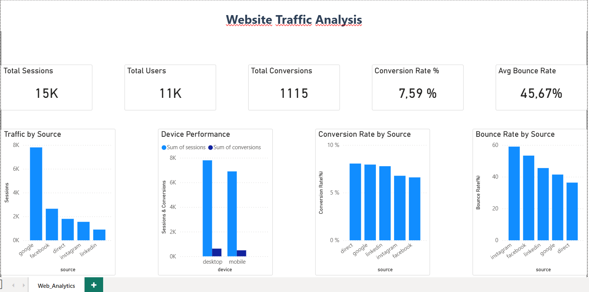

# 📊 Web Traffic & Bounce Rate Analysis

---

## 🧠 Overview
This project analyzes website traffic behavior to identify high-bounce segments and uncover UX or landing page issues affecting paid marketing performance.

The analysis combines **SQL (PostgreSQL)** for data exploration and **Power BI** for visualization and storytelling.

---

## 🎯 Business Objective
To understand why paid social campaigns (Instagram and Facebook) show higher bounce rates and identify patterns across **traffic source and device type** that impact user engagement.

---

## 📂 Dataset
- Simulated web traffic dataset (15 records)
- Stored in PostgreSQL (Supabase)
- Table: `web_analytics.website_traffic`

---

## 🛠️ Tools Used
- PostgreSQL (SQL analysis)
- Supabase (database hosting)
- Power BI (dashboard & visualization)

---

## 📊 Key Findings

- 📱 Instagram Paid Traffic (Mobile) → 59% bounce rate  
- 📱 Facebook Paid Traffic (Mobile) → 54% bounce rate  
- 💻 Facebook Paid Traffic (Desktop) → 52% bounce rate  
- 🎯 Direct Traffic → 35–37% bounce rate (lowest, highest intent)  

---

## 🔍 Insights

- Paid social traffic performs significantly worse on mobile devices  
- Device type strongly influences bounce behavior  
- Direct traffic shows higher user intent and engagement  
- There is a potential mismatch between ad targeting and landing page experience  

---

## 🧪 Hypothesized Causes

- ⏳ Slow page load times on mobile devices  
- 📱 Poor mobile responsiveness of landing pages  
- 🔄 Misalignment between ad messaging and landing page content  
- 🎯 Landing pages not aligned with user intent  

---

## 💡 Recommendation

Perform a mobile UX + landing page audit for Instagram and Facebook paid campaigns to improve engagement and reduce bounce rates.

---

## 📊 Power BI Storytelling

The dashboard was designed to answer:

- Which traffic source have the highest bounce rates?
- How does device type impact user engagement?
- Which channel drive the most high-intent users?

---

## 📌 Dashboard Highlights

- Bounce rate breakdown by source  
- Device-level performance comparison  
- Conversion vs bounce behavior analysis  
- Paid vs organic traffic comparison  

---

## 📸 Dashboard Preview

